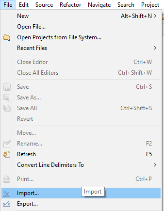
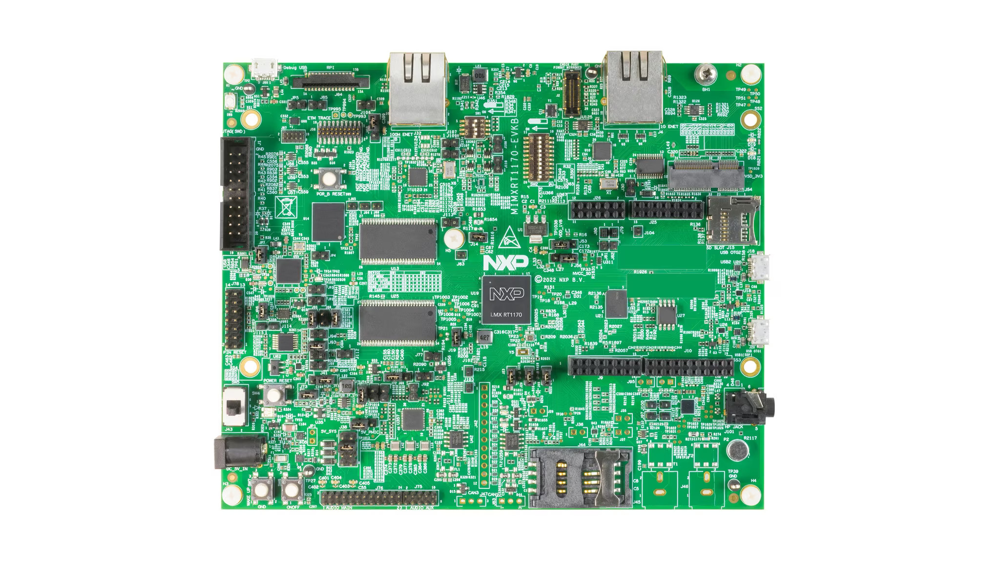
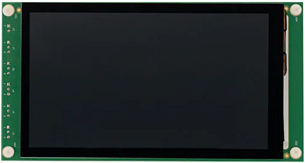
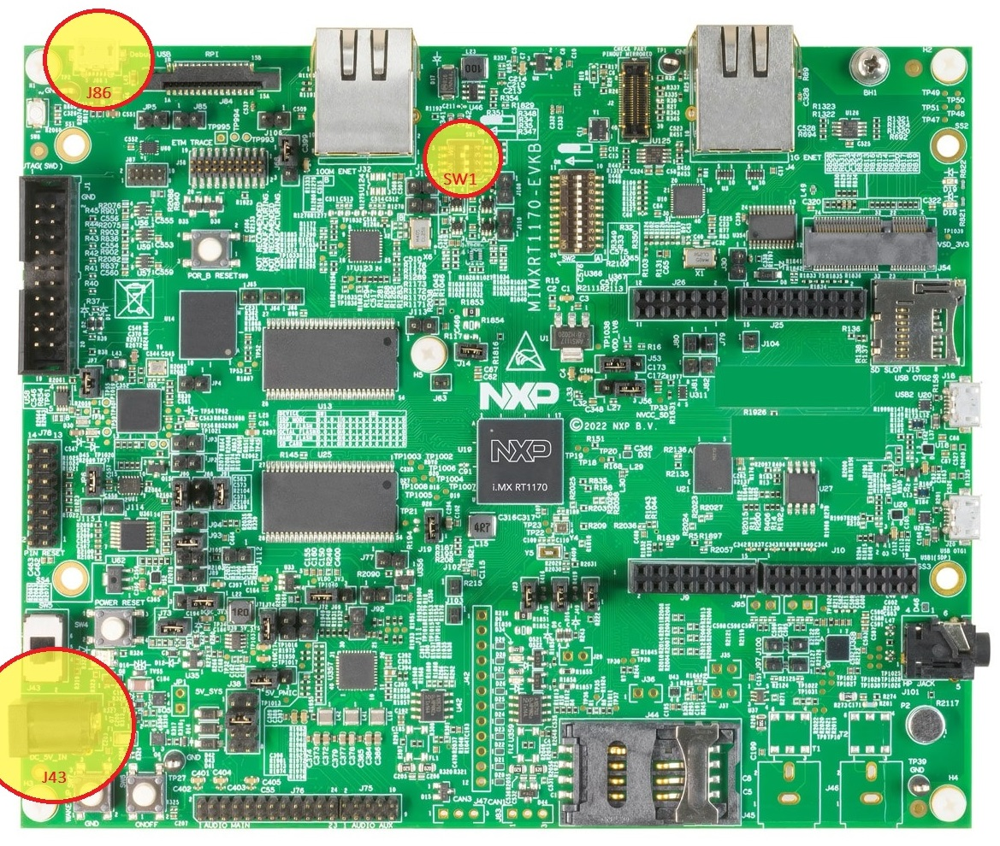
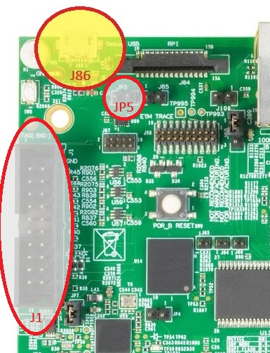
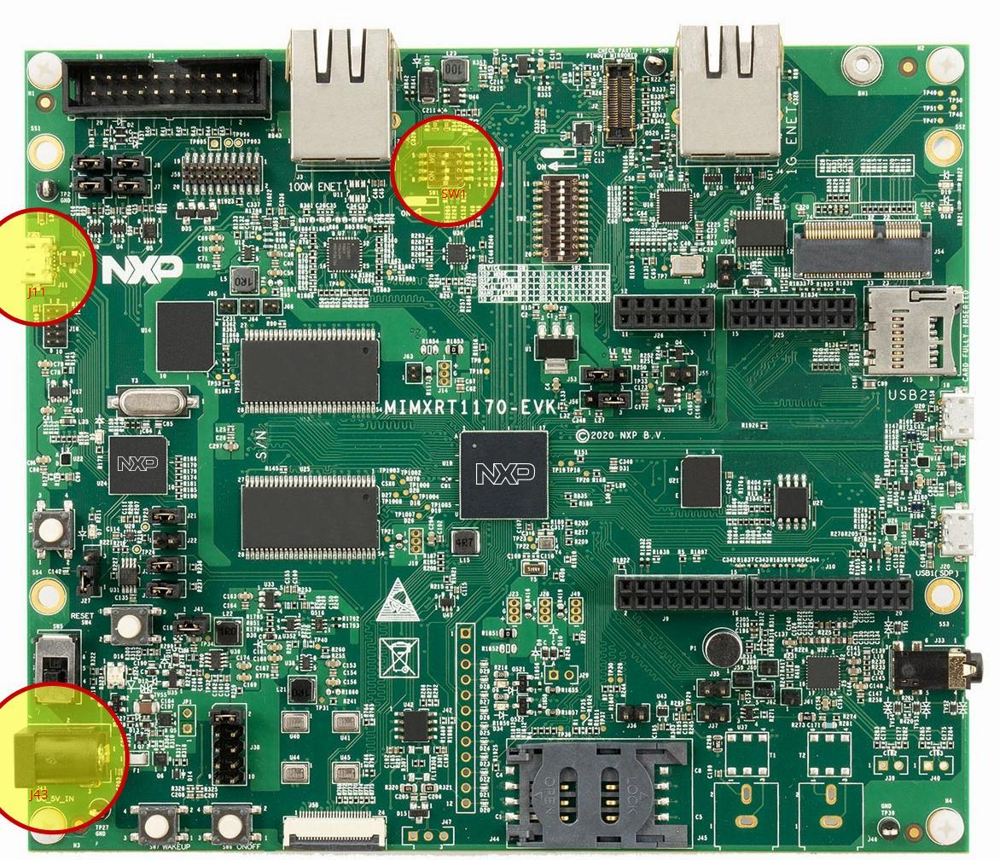
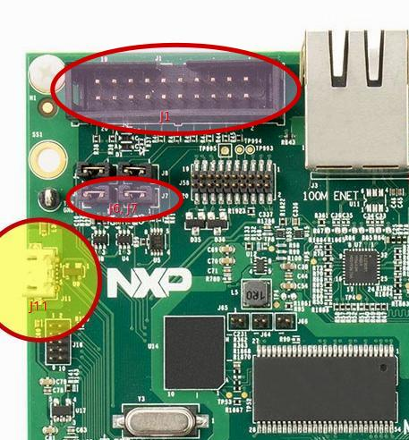

# MicroEJ VEE Port for NXP i.MX RT1170 Evaluation Kit

This project is used to build a MicroEJ VEE Port for [i.MX RT1170 Evaluation Kit](https://www.nxp.com/design/design-center/development-boards-and-designs/i-mx-evaluation-and-development-boards/i-mx-rt1170-evaluation-kit:MIMXRT1170-EVKB).

## Related Files

This directory contains:

* [CHANGELOG](./CHANGELOG.md) to track the changes in the VEE Port
* [RELEASE NOTES](./RELEASE_NOTES.md) to list:

    - the versions of the VEE Port, of its dependencies and of the BSP,
    - the features provided by each Foundation Library pack,
    - the known issues and the limitations,
    - the memory layout of the VEE Port.
* [LICENSE](./LICENSE.txt) and [NOTICE](./NOTICE.txt) to describe the license terms of the VEE Port and of its third-party components

## Table of Contents

- [VEE Port Specifications](#vee-port-specifications)
- [Fetch the Source Code](#fetch-the-source-code)
- [Requirements](#requirements)
- [Run an Application on the Simulator](#run-an-application-on-the-simulator)
- [Run an Application on the Board](#run-an-application-on-the-board)
- [Optional Features](#optional-features)
- [Troubleshooting](#troubleshooting)

## VEE Port Specifications

The architecture version is `8.6.0`.

This VEE Port provides the following Foundation Libraries:

|Foundation Library| Version |
|------------------|---------|
|BON               | 1.5     |
|DEVICE            | 1.2     |
|DRAWING           | 1.0     |
|ECOM-WIFI         | 2.3     |
|EDC               | 1.3     |
|EVENT             | 3.0     |
|FS                | 2.1     |
|GPIO              | 1.0     |
|KF                | 1.7     |
|MICROAI           | 2.3     |
|MICROUI           | 3.6     |
|MICROVG           | 1.5     |
|NET               | 1.1     |
|SECURITY          | 1.7     |
|SERIAL            | 3.0     |
|SNI               | 1.4     |
|SSL               | 2.2     |
|TRACE             | 1.1     |

This VEE Port is compatible with MicroEJ SDK6 or higher.

## Fetch the Source Code

The source code is fetched with [West](https://docs.zephyrproject.org/latest/develop/west/install.html), which must be installed first.

Clone the repository with the following commands:

```bash
mkdir nxpvee-mimxrt1170-prj
cd nxpvee-mimxrt1170-prj
west init -m https://github.com/nxp-mcuxpresso/nxp-vee-imxrt1170-evk .
west update
```

The following repositories will be created:

```text
nxpvee-mimxrt1170-evk
.west
```

> Note: On Windows, your path to the repository folder should be as short as possible

> Note: Your path should not contain a whitespace or special character

## Requirements

* A PC with Windows 10 or higher or Linux (tested with Ubuntu 24.04)
* An internet connection to use the [MicroEJ Central Repository](https://developer.microej.com/central-repository/)
* MICROEJ SDK 6, installed by following the [SDK 6 Installation Documentation](https://docs.microej.com/en/latest/SDK6UserGuide/install.html)

## Run an Application on the Simulator

To run an application on the Simulator, the BSP and the C toolchain are not required.

### Open the Project

Launch your IDE chosen during MicroEJ installation step and open the project folder (`nxpvee-mimxrt1170-evk`). The following screenshots show Visual Studio Code, but similar results can be obtained with another IDE.

<p float="left">
  
</p>

Then wait for your IDE to finish loading the project, as indicated in the message in the status bar:

<p float="left">
  
</p>

Once loaded, you should see the following files and folders:

<p float="left">
  
</p>

And the Gradle view should look like this:

<p float="left">
  
</p>

The project contains the following subprojects and directories:

- `apps`: Contains the sample applications that use the VEE Port (see [Choose Your Demo Application](#choose-your-demo-application)).
- `vee-port`: Contains the VEE Port configuration.
- `vee-port/extensions`: Contains the MicroUI configuration, the Front Panel and Image Generator used by the Simulator.
- `vee-port/mock`: Contains the mock of the native functions of the sample applications, used by the Simulator.
- `vee-port/validation`: Contains the testsuites to validate the Abstraction Layers implementation.
- `bsp/vee/port`: Contains the Abstraction Layers of each Foundation Library.
- `bsp/vee/src`: Contains the board configuration and the `main` entry point of the BSP.
- `bsp/vee/scripts`: Contains the build, flash and clean scripts of the BSP.
- `bsp/mcux-sdk`: Contains the MCUXpresso SDK, fetched by `west update`.

### Choose Your Demo Application

Five MicroEJ applications are included in this release.

* The `HelloWorld` application displays "Hello World" periodically. More details in [this README](apps/HelloWorld/README.md).
* The `SimpleGFX` application displays three moving rectangles using the [MicroUI API](https://docs.microej.com/en/latest/ApplicationDeveloperGuide/UI/MicroUI/index.html#section-app-microui). The coordinates of the rectangles are calculated in C native functions. More details in [this README](apps/simpleGFX/README.md).
* The `AnimatedMascot` application draws an animated [Android Vectordrawable](https://developer.android.com/develop/ui/views/graphics/vector-drawable-resources) image. It uses the RT1170's GCNanoLite-V GPU as an accelerator. More details in [this README](apps/animatedMascot/README.md).
* The `AiSample` Application runs an inference of sample images on a CifarNet quantized TensorFlow Lite model. You can find the AI library API in the [MicroEJ Developer Repository](https://forge.microej.com/ui/native/microej-developer-repository-release/com/nxp/api/ai/). More details in [this README](apps/aiSample/README.md).
* The `serialSample` Application demonstrates how to use [Serial](https://docs.microej.com/en/latest/ApplicationDeveloperGuide/serialCommunications.html) library with a simple echo sample.

### Execute `runOnSimulator` Task

To run an application in simulation mode, go to the Gradle view, expand the tasks of the chosen demo project, then double-click on the `microej` > `runOnSimulator` task:

<p float="left">
  
</p>

Here is the `AnimatedMascot` application running in simulation:

<p float="left">
  
</p>

The `runOnSimulator` task also builds the VEE Port declared as dependency if required.

## Run an Application on the Board

### Hardware Requirements

* An [i.MX RT1170 Evaluation Kit](https://www.nxp.com/design/design-center/development-boards-and-designs/i-mx-evaluation-and-development-boards/i-mx-rt1170-evaluation-kit:MIMXRT1170-EVKB) board
* An [RK055HDMIPI4MA0](https://www.nxp.com/part/RK055HDMIPI4MA0#/) 5.5" LCD panel
* Optionally: a J-Link debug probe to flash the software
* Optionally: a MicroSD card to use the file system

<p float="left">
  
   
</p>

### Board Technical Specifications

|                         |               |
| ----------------------- | ------------- |
|MCU part number          |MIMXRT1170     |
|MCU architecture         |Arm Cortex-M7  |
|MCU max clock frequency  |1 GHz          |
|Internal RAM size        |1MB - 2MB      |
|External RAM size        |64MB           |
|Internal flash size      |-              |
|External flash size      |16MB           |
|eMMC/SD support          |yes            |
|Display                  |1280x720 MIPI  |
|GPU                      |2D GPU with vector graphics acceleration|
|Ethernet interface       |100Mbit / 1Gbit|
|WiFi interface           |via extension board|

### Get the Build Tools

The BSP is built and flashed with the scripts provided in [bsp/vee/scripts](bsp/vee/scripts).
These scripts need the following tools:

* [CMake](https://cmake.org/download/) version 3.27 or higher
* [Ninja](https://github.com/ninja-build/ninja/releases)
* [Make](https://gnuwin32.sourceforge.net/packages/make.htm) version 3.81 or higher
* [ARM GNU Toolchain](https://developer.arm.com/downloads/-/arm-gnu-toolchain-downloads) version 13.2.Rel1 (version 14 is not supported)
* [LinkServer](https://www.nxp.com/design/design-center/software/development-software/mcuxpresso-software-and-tools-/linkserver-for-microcontrollers:LINKERSERVER) version 1.6.133 or higher, to flash with the on-board probe
* [SEGGER J-Link](https://www.segger.com/downloads/jlink/), only to flash with an external J-Link probe

> Note: On Ubuntu 22.04 or lower, the CMake package of the distribution is too old: install CMake from the link above.

#### Environment Variables

The following environment variables must be configured:

* ``ARMGCC_DIR``: the installation directory of ARM GNU Toolchain, for example ``C:\Program Files (x86)\Arm GNU Toolchain arm-none-eabi\13.2 Rel1``
* If you use LinkServer to flash your device, add to ``PATH`` the installation directory of LinkServer, for example ``C:\NXP\LinkServer_24.12.21``.
* If you use a J-Link probe on Windows, set ``JLINK_INSTALLATION_DIR`` to the installation directory of SEGGER J-Link, for example ``C:\Program Files\SEGGER\JLink``. On Linux, ``JLinkExe`` must be in ``PATH``.
* CMake, Ninja and Make must be in ``PATH``.

### Board Setup

There are two revisions of the i.MX RT1170 EVK: MIMXRT1170-EVKB and MIMXRT1170-EVK.

Depending on the revision of your evaluation kit, follow the corresponding hardware setup: 

* [MIMXRT1170-EVKB](#mimxrt1170-evkb)
* [MIMXRT1170-EVK](#mimxrt1170-evk)

#### MIMXRT1170-EVKB

<p float="left">
  
</p>

##### Setup the i.MX RT1170 EVKB

* Check that the DIP switches (SW1) are set to OFF, OFF, ON, and OFF.
* Connect a micro-USB cable to J86 to power the board.
* You can connect a 5V power supply to J43 if you need to use the display

The USB connection is used as a serial console for the SoC, as a CMSIS-DAP debugger, and as a power input for the board.

The MicroEJ VEE Port uses the virtual UART from the i.MX RT1170 EVKB USB port. A COM port is automatically mounted when the board is plugged into a computer using a USB cable. All board logs are available through this COM port.

The COM port uses the following parameters:

| Baudrate | Data bits | Parity bits | Stop bits | Flow control |
| -------- | -------- | -------- | -------- | -------- |
| 115200     | 8     | None     | 1     | None     |

##### Debugger Options

The i.MX RT1170 EVKB can either be flashed and connected to a debugger through the USB port J11 or the JTAG connector J1:

* To use the USB for flashing and debugging, jumper JP5 should be removed.
* To use the JTAG for flashing and debugging with an external probe, jumper JP5 should be connected.

<p float="left">
  
</p>

Once your setup is done, continue this README at the [Build and Deploy](#build-and-deploy) section.

#### MIMXRT1170-EVK

<p float="left">
  
</p>

##### Setup the i.MX RT1170 EVK

* Check that the DIP switches (SW1) are set to OFF, OFF, ON, and OFF.
* Connect the micro-USB cable to J11 to power the board.
* You can connect a 5V power supply to J43 if you need to use the display

The USB connection is used as a serial console for the SoC, as a CMSIS-DAP debugger, and as a power input for the board.

The MicroEJ VEE Port uses the virtual UART from the i.MX RT1170 EVK USB port. A COM port is automatically mounted when the board is plugged into a computer using a USB cable. All board logs are available through this COM port.

The COM port uses the following parameters:

| Baudrate | Data bits | Parity bits | Stop bits | Flow control |
| -------- | -------- | -------- | -------- | -------- |
| 115200     | 8     | None     | 1     | None     |

##### Debugger Options

The i.MX RT1170 EVK can either be flashed and connected to a debugger through the USB port J11 or the JTAG connector J1:

* To use the USB for flashing and debugging, jumpers J6 and J7 should be connected.
* To use the JTAG for flashing and debugging with an external probe, jumpers J6 and J7 should be removed.

<p float="left">
  
</p>

Once your setup is done, continue this README at the [Build and Deploy](#build-and-deploy) section.

### Build and Deploy

#### Configure the Board

To configure the board, change the `CHOSEN_BOARD` variable in [set_project_env.bat](bsp/vee/scripts/set_project_env.bat) or [set_project_env.sh](bsp/vee/scripts/set_project_env.sh):

* Set it to `evk` for i.MX RT1170 EVK
* Set it to `evkb` for i.MX RT1170 EVKB

#### Configure Debug or Release Mode

To configure the debug or release mode, change the `CHOSEN_MODE` variable in [set_project_env.bat](bsp/vee/scripts/set_project_env.bat) or [set_project_env.sh](bsp/vee/scripts/set_project_env.sh):

* Set it to `0` for debug mode
* Set it to `1` for release mode

#### Configure the Debug Probe

To configure the debug probe, change the `CHOSEN_PROBE` variable in [set_project_env.bat](bsp/vee/scripts/set_project_env.bat) or [set_project_env.sh](bsp/vee/scripts/set_project_env.sh):

* Set it to `flash` for a J-Link probe
* Set it to `flash_cmsisdap` for board internal probe

#### Configure the BSP Features

Compilation flags are located in [CMakePresets.json](bsp/vee/scripts/armgcc/CMakePresets.json).
Edit this file to enable or disable features.

For changes in this file to take effect, the script [clean.bat](bsp/vee/scripts/clean.bat) or [clean.sh](bsp/vee/scripts/clean.sh) must be called.

#### Launch `runOnDevice` Gradle Task

To build and deploy your executable on your board, go to the Gradle view, expand the tasks of the chosen demo project, then double-click on the `microej` > `runOnDevice` task:

<p float="left">
  
</p>

If you don't have a MicroEJ license, you will get an error message telling you to get one. Follow [the instructions from MicroEJ](https://docs.microej.com/en/latest/SDK6UserGuide/licenses.html#evaluation-licenses) to get an evaluation license. To switch to a production license, contact your MicroEJ representative.

This task calls:

* [build.bat](bsp/vee/scripts/build.bat) or [build.sh](bsp/vee/scripts/build.sh) to build the BSP,
* [run.bat](bsp/vee/scripts/run.bat) or [run.sh](bsp/vee/scripts/run.sh) script to flash the program on the target without opening a debug session.

#### Build and Deploy from the Command Line

The build and flash scripts can be called directly to rebuild the BSP without rebuilding the MicroEJ application.
This requires the MicroEJ application object files (`microejapp.o` and `microejruntime.a` in `bsp/vee/lib`) to be already generated, by a previous call to the `buildExecutable` or `runOnDevice` Gradle task.

##### Build the Executable

The board, the debug or release mode and the probe are selected in [set_project_env.bat](bsp/vee/scripts/set_project_env.bat) or [set_project_env.sh](bsp/vee/scripts/set_project_env.sh), as described in [Build and Deploy](#build-and-deploy).

From the `nxpvee-mimxrt1170-evk` directory, run:

* On Windows: `bsp\vee\scripts\build.bat`
* On Linux: `bsp/vee/scripts/build.sh`

The executable is copied to the current directory as `application.out`, `application.hex` and `application.bin`.

##### Flash the Board

From the `nxpvee-mimxrt1170-evk` directory, run:

* On Windows: `bsp\vee\scripts\run.bat`
* On Linux: `bsp/vee/scripts/run.sh`

Once the firmware is flashed, the application starts on the board.

#### MCUXpresso for VS Code

The [.vscode](.vscode) folder contains a configuration for the [MCUXpresso for VS Code](https://www.nxp.com/design/design-center/software/embedded-software/mcuxpresso-for-visual-studio-code:MCUXPRESSO-VSC) extension.
It is kept for users who already work with this extension, but its compatibility with new releases of the extension is not guaranteed.
The build and flash scripts described above are the supported way to build and deploy the executable.

## Optional Features

### Multi-Sandbox

For information on multi-sandbox, see the [MicroEJ documentation](https://docs.microej.com/en/latest/VEEPortingGuide/multiSandbox.html).

By default, the VEE Port is built in mono-sandbox. Multi-sandbox can be enabled by editing `com.microej.runtime.capability` property of [configuration.properties](vee-port/configuration.properties) file and change its value to `multi`.

### AI

AI can be enabled or disabled by changing `ENABLE_AI` value in [CMakePresets.json](bsp/vee/scripts/armgcc/CMakePresets.json).
Set it to 1 to enable it and 0 to disable it.
Call [clean.bat](bsp/vee/scripts/clean.bat) or [clean.sh](bsp/vee/scripts/clean.sh) after changing this value.

### Serial

The VEE Port is configured so that `LPUART2` is readily available:

* TX: connector `J9`, pin `4`.
* RX: connector `J9`, pin `2`.
* GND is available on `J9`, pins {`1`, `5`, `7`, `9`, `11`, `13`, `15`}, see schematics for more information.

It is also possible to use `LPUART7` but at the expense of disabling display support. 
To do so, set `ENABLE_LPUART7` CMake variable to 1 in [CMakePresets.json](bsp/vee/scripts/armgcc/CMakePresets.json). 
**It will automatically remove MicroUI and MicroVG modules from the BSP compilation.**

* TX: connector `J25`, pin `15`.
* RX: connector `J25`, pin `13`.

### System View

For information about System View, see the [SEGGER website](https://www.segger.com/products/development-tools/systemview/) or [MicroEJ documentation](https://docs.microej.com/en/latest/VEEPortingGuide/systemView.html#microej-core-engine-os-task).

Follow these steps to run a System View live analysis:

* Set `ENABLE_SYSTEM_VIEW` CMake variable to 1 in [CMakePresets.json](bsp/vee/scripts/armgcc/CMakePresets.json).
* Call [clean.bat](bsp/vee/scripts/clean.bat) or [clean.sh](bsp/vee/scripts/clean.sh).
* Set `CHOSEN_PROBE` to `flash` in [set_project_env.bat](bsp/vee/scripts/set_project_env.bat) or [set_project_env.sh](bsp/vee/scripts/set_project_env.sh).
* Execute the `runOnDevice` Gradle task. Use a J-Link probe to flash your target.
* Open System View PC application
* Go to Target > Start Recording
* Select the following Recorder Configuration:
  * J-Link Connection = USB
  * Target Connection = MIMXRT1176XXXA_M7
  * Target Interface = SWD
  * Interface Speed (kHz) = 4000
  * RTT Control Block Detection = Auto
* Click Ok

If you have an issue, see the [Troubleshooting section](https://docs.microej.com/en/latest/VEEPortingGuide/systemView.html#troubleshooting) of the MicroEJ documentation.

### Ethernet Port Configuration

By default, this VEE Port uses the 1G ethernet port.

It can also be configured to use the second 100M port instead. To do this, follow these instructions:

* Set `BOARD_NETWORK_USE_100M_ENET_PORT` to 1 in [board.h](bsp/vee/src/bsp/board.h)
* If you are using a `MIMXRT1170-EVKB`, remove the resistor `R136`. This is done to avoid issues with the MDC pin of the port.

### MicroEJ Core Validation

To launch MicroEJ Core validation, set `RUN_MICROEJ_CORE_VALIDATION` CMake variable in [CMakePresets.json](bsp/vee/scripts/armgcc/CMakePresets.json).

## Troubleshooting

### Setup Error

#### West Update and "Filename too long" Issue

On Windows, fetching the source code may trigger the following fatal error:
```error: unable to create file [...]: Filename too long.```

To avoid this, git configuration needs to be updated to handle long file names:

Start Git Bash as Administrator.

Run the following command:
```git config --system core.longpaths true```

#### West Update and "PermissionError: [WinError 5] Access is denied" Issue

If you get the error `PermissionError: [WinError 5] Access is denied`, use the following procedure:

```bash
rm .west
cd nxpvee-mimxrt1170-evk
west init -l
cd ..
west update
```

### Ninja Errors during BSP Build

#### Ninja: error: loading 'build.ninja': The system cannot find the file specified

If you get the following error during the BSP build:

```text
"Failed to build the firmware"
ninja: error: loading 'build.ninja': The system cannot find the file specified.
make: *** [remake] Error 1
```

There are three common reasons for this issue:

- **CMake cache problem**
  The build system may be using outdated or corrupted cache files.
  Fix: remove the CMake cache by running [clean.bat](bsp/vee/scripts/clean.bat) or [clean.sh](bsp/vee/scripts/clean.sh).

- **Path length limitation on Windows**
  If the Git project is cloned into a directory with a very long path, the `mcux-sdk` dependency might not clone properly.
  Fix: move or clone the project into a directory with a path as short as possible.

- **Repository cloned with Git instead of West**
  If the repository is cloned with `git clone` instead of `west init` and `west update`, the `bsp/mcux-sdk` directory is not populated.
  Fix: fetch the dependencies with West, from the root directory of the cloned repository:

  ```bash
  west init -l
  cd ..
  west update
  ```

### Flash Issue

Flash may not work out of the box.
If this is the case:

- Check that the chosen probe matches the flash method used.
- Update the firmware of the on-board debugger, which may not be up to date.

### Known Issues

The known issues and limitations of this release are listed in the [release notes](RELEASE_NOTES.md).

---

_Markdown_  

_Copyright 2026 MicroEJ Corp. All rights reserved._
_Use of this source code is governed by a BSD-style license that can be found with this software._

_Build: 7E4D1F7C_
